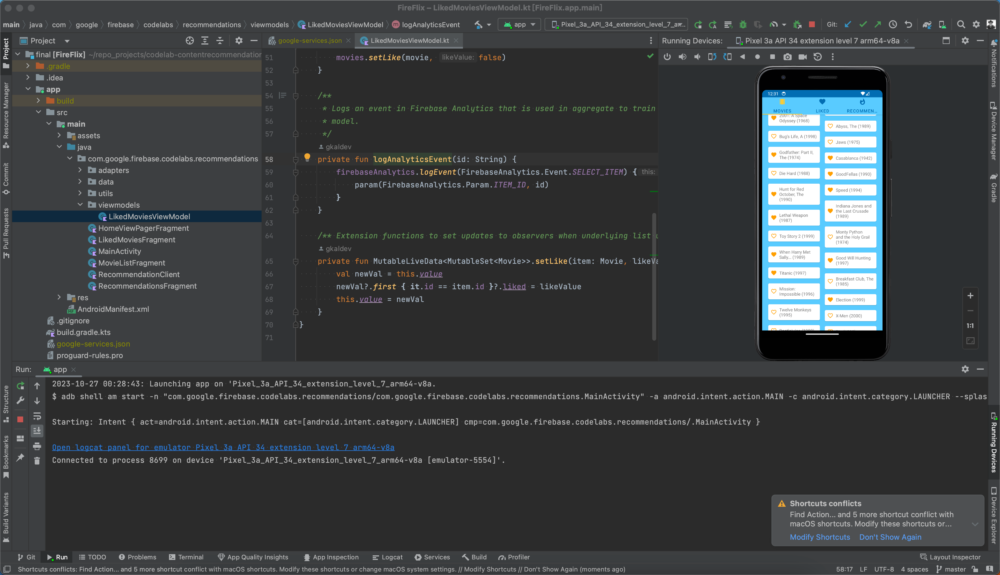
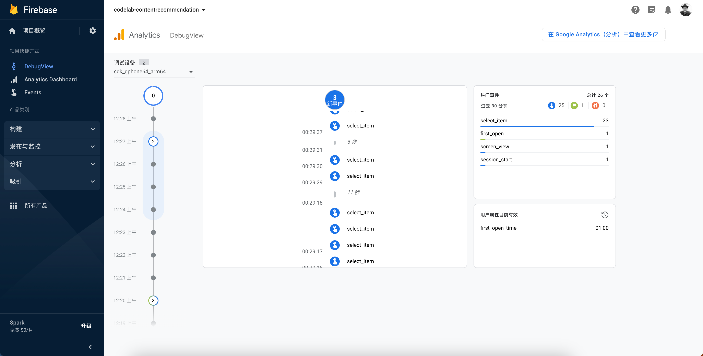

This repo contains the source code for the Content Recommendations with TensorFlow Lite and Firebase on Android codelab. Please follow the codelab for instructions on how to use this source and associated Colab notebook.

```bash
app
├── build.gradle.kts
├── google-services.json
├── proguard-rules.pro
└── src
    └── main
        ├── AndroidManifest.xml
        ├── assets
        │   ├── logo-vertical-crop.svg
        │   ├── recommendation_cnn_i10o100.tflite
        │   └── sorted_movie_vocab.json
        ├── java
        │   └── com
        │       └── google
        │           └── firebase
        │               └── codelabs
        │                   └── recommendations
        │                       ├── HomeViewPagerFragment.kt
        │                       ├── LikedMoviesFragment.kt
        │                       ├── MainActivity.kt
        │                       ├── MovieListFragment.kt
        │                       ├── RecommendationClient.kt
        │                       ├── RecommendationsFragment.kt
        │                       ├── adapters
        │                       │   ├── FireFlixPagerAdapter.kt
        │                       │   ├── MoviesAdapter.kt
        │                       │   └── RecommendationsAdapter.kt
        │                       ├── data
        │                       │   ├── Movie.kt
        │                       │   └── MovieRepository.kt
        │                       ├── utils
        │                       │   ├── Config.kt
        │                       │   ├── FileUtils.java
        │                       │   ├── MovieUtils.kt
        │                       │   └── ViewUtils.kt
        │                       └── viewmodels
        │                           └── LikedMoviesViewModel.kt
        └── res
            ├── drawable
            │   ├── ic_baseline_favorite_24.xml
            │   ├── ic_baseline_favorite_border_24.xml
            │   ├── ic_baseline_filter_list_24.xml
            │   ├── ic_baseline_local_movies_24.xml
            │   ├── ic_baseline_perm_identity_24.xml
            │   ├── ic_baseline_search_24.xml
            │   ├── ic_baseline_star_24.xml
            │   ├── ic_baseline_star_border_24.xml
            │   ├── ic_baseline_whatshot_24.xml
            │   ├── ic_launcher_background.xml
            │   ├── ic_logo_vertical_crop.xml
            │   ├── select.xml
            │   └── tab_icon_color_selector.xml
            ├── drawable-v24
            │   ├── ic_detail_back_no_circle.xml
            │   └── ic_launcher_foreground.xml
            ├── layout
            │   ├── fragment_liked_movies.xml
            │   ├── fragment_movie_list.xml
            │   ├── fragment_recommendations.xml
            │   ├── fragment_view_pager.xml
            │   ├── list_item_movie.xml
            │   ├── list_item_recommendation.xml
            │   └── main_activity.xml
            ├── menu
            │   └── options.xml
            ├── mipmap-anydpi-v26
            │   ├── ic_launcher.xml
            │   └── ic_launcher_round.xml
            ├── mipmap-hdpi
            │   ├── ic_launcher.png
            │   └── ic_launcher_round.png
            ├── mipmap-mdpi
            │   ├── ic_launcher.png
            │   └── ic_launcher_round.png
            ├── mipmap-xhdpi
            │   ├── ic_launcher.png
            │   └── ic_launcher_round.png
            ├── mipmap-xxhdpi
            │   ├── ic_launcher.png
            │   └── ic_launcher_round.png
            ├── mipmap-xxxhdpi
            │   ├── ic_launcher.png
            │   └── ic_launcher_round.png
            ├── navigation
            │   └── nav_graph.xml
            ├── values
            │   ├── colors.xml
            │   ├── dimens.xml
            │   ├── integers.xml
            │   ├── shape
            │   │   └── shape.xml
            │   ├── strings.xml
            │   └── styles.xml
            └── xml
                └── searchable.xml
```


|  |  |
| :-----------------------------: | :-----------------------------: |
|           Image 1 Caption       |           Image 2 Caption       |