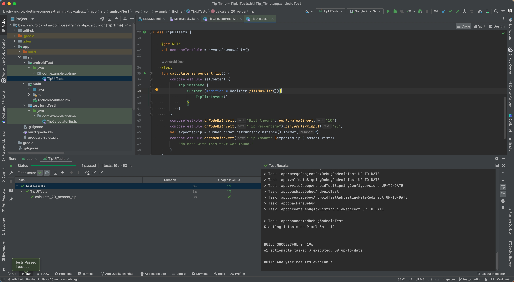

# Traning Courses

> Whether a new developer, just new to Android, or an experienced professional, grow your skills with training created by Google's Android development experts. Then get certified as an Android developer to grow your career.

## For beginners

### Android Basics with Compose

#### Unit 1 Your fist Android app

- Jetpack Compose 是用于构建 Android 界面的新款工具包。它使用更少的代码、强大的工具和直观的 Kotlin API，可以帮助您简化并加快 Android 界面开发

- 可组合函数是 Compose 的基本构建块。可组合函数是用于描述界面中某一部分的函数

- 任何标有 @Composable 注解的函数都可通过 setContent() 函数或其他可组合函数进行调用。该注解可告知 Kotlin 编译器 Jetpack Compose 使用的这个函数会生成 UI。

- Jetpack Compose 中有各种各样的内置注解

- 可缩放像素 (SP) 是字体大小的度量单位。Android 应用中的界面元素使用两种不同的度量单位：一种是您稍后将为布局使用的密度无关像素 (DP)，另一种就是可缩放像素 (SP)。默认情况下，SP 单位与 DP 单位大小相同，但前者的大小会根据用户在手机设置下的首选文本大小进行调整。

- AndroidX（Android 扩展）库包含一组库和类，通过提供核心功能帮助您加快应用开发。您可以使用 androidx 软件包获得这些类、属性和其他工件。

- Resource Manager 标签页可帮助您添加和整理图片及其他资源

#### Unit 2: Building app UI

> Continue learning the fundamentals of Kotlin, and start building more interactive apps.

- Kotlin Fundamentals

- Add a button to an app

- Interact with UI and state

work with state | remember function | 

Understanding what is state, how to remember state, and how to move state outside of a composable is an important step in building apps.

Understanding when and how to hoist the state will allow you to create stateless and reusable composables to build more complex and interactive apps.

就软件而言，测试是一种检查软件以确保其按预期运行的系统化方法。自动化测试是一段代码，用于检查您所编写的另一段代码，确保其能正常运行。

自动化测试是通过软件执行的测试，手动测试则与之相反，是由人直接与设备互动来进行测试。自动化测试和手动测试对于确保产品用户获得愉快的体验至关重要。不过，自动化测试不仅准确性更高，还能提高团队的工作效率（因为不需要分派人手运行测试），而且执行速度也比手动测试要快得多。

自动化测试类型: 本地测试 和 插桩测试

测试是软件质量控制的关键环节。随着您不断构建 Android 应用，务必要在编写应用功能的同时编写测试，以确保在整个开发过程中应用都能够正常运行。

#### Unit 3: Display lists and use Material Design 3 Pathways

> Build apps that display a list of data and learn how to make your apps more beautiful with Material Design.

- Use data classes, functions, and collections in Kotlin.

- Create a scrollable list in an app that displays both text and images.

- Add click listeners to interact with list items.

- Add an app bar to the app and modify the app theme.

- Use Material Design to build modern and intuitive user interfaces, using colors, shapes and typography.

##### 3-1 More Kotlin fundamentals

数十年来，编程人员设计了多种编程语言功能来帮助您编写更好的代码，例如使用更少的代码表达相同概念、通过抽象化表达复杂的想法、编写代码防止其他开发者不小心犯错等。Kotlin 语言也不例外，其中许多功能都旨在帮助开发者编写更具表现力的代码。

作用域函数属于高阶函数: let(), apply(), 

泛型支持将数据类型作为形参传递到类, 枚举类可以定义有限数量的可能值, 而数据类有助于为类自动生成一些有用的方法.

了解了如何创建单例对象（仅限一个实例）\ 如何使其成为另一个类的伴生对象, 以及如何使用新的 get-only 属性和新的方法来扩展现有的类. 最后, 您看到了一些示例, 了解了作用域函数如何能够在访问属性和方法时提供更简洁的语法.

了解如何将高阶函数与集合结合使用, forEach, map, filter, fold, groupBy, sortedBy...

##### 3-2 Build a scrollable list

- 使用 `Card` 可组合项创建列表项, 修改 `Card` 中包含的界面, 使用 `lazyColumn` 创建可滚动列表, 自定义构建列表

- Android 8.0 系统支持了自适应图标, 意味着应用图标由两个图层组成: 前景图层和背景图层

- Use Card composables to create list items

- Modify the UI contained within a Card composable

- Create a scrollable list using the LazyColumn composable

##### 3-3 Build beautiful apps

Material Theme Builder `=>` Color.kt, Theme.kt, Shape.kt, Type.kt

> 回顾 remember() 和 mutableStateOf()：
> 使用 `mutableStateOf()` 函数，以便 `Compose` 观察状态值发生的更改，并触发重组来更新界面。使用 `remember()` 函数封装 `mutableStateOf()` 函数调用，以在初始组合期间将值存储在组合中，并在重组期间返回存储的值。

#### Unit 4: Navigation and app architecture

#### Unit 5: Connect to the internet

#### Unit 6: Data persistence

#### Unit 7: WorkManager

#### Unit 8: Views and Compose

### Android Basics in Kotlin

## For experienced Android developers

### Jetpack Compose for Android developers

### Modern Android app architecture

### Accessibility

### Kotlin coroutines

## Kotlin language training

### Kotlin bootcamp for programmers

### Kotlin for Java developers

Declaring nullability, val, var and data classes

Default arguments, named arguments

Object initialization, companion object and singletons

Handling nullability

String templates

Operations on collections

Properties and backing properties

Top-level and extension functions and properties

Scope functions: let, apply, with, run, also. [Download the scope functions cheat sheet from](https://medium.com/androiddevelopers/kotlin-standard-functions-cheat-sheet-27f032dd4326)

@JvmStatic 注解用于指示 Kotlin 编译器生成带注解的成员或方法的静态版本。

StringExtensions 和 @JvmName

User class and @JvmOverloads

User and @JvmName

## For Android Java developers

### Android Room with a View - Java

### Background work with WorkManager - Java

## Certification and degree programs

> Showcase your skills with a Google-certified credential.
