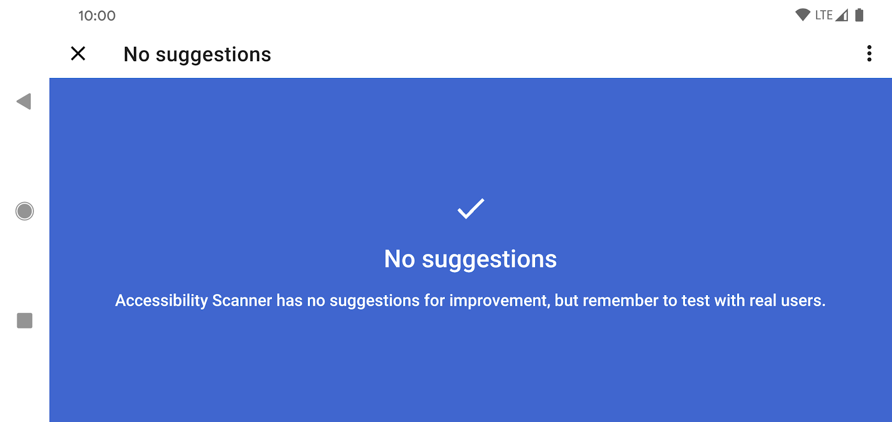

# Traning Courses

> Whether a new developer, just new to Android, or an experienced professional, grow your skills with training created by Google's Android development experts. Then get certified as an Android developer to grow your career.

## For beginners

### Android Basics with Compose

#### Unit 1 Your fist Android app

- Jetpack Compose 是用于构建 Android 界面的新款工具包。它使用更少的代码、强大的工具和直观的 Kotlin API，可以帮助您简化并加快 Android 界面开发

- 可组合函数是 Compose 的基本构建块。可组合函数是用于描述界面中某一部分的函数

- 任何标有 @Composable 注解的函数都可通过 setContent() 函数或其他可组合函数进行调用。该注解可告知 Kotlin 编译器 Jetpack Compose 使用的这个函数会生成 UI。

- Jetpack Compose 中有各种各样的内置注解

- 可缩放像素 (SP) 是字体大小的度量单位。Android 应用中的界面元素使用两种不同的度量单位：一种是您稍后将为布局使用的密度无关像素 (DP)，另一种就是可缩放像素 (SP)。默认情况下，SP 单位与 DP 单位大小相同，但前者的大小会根据用户在手机设置下的首选文本大小进行调整。

- AndroidX（Android 扩展）库包含一组库和类，通过提供核心功能帮助您加快应用开发。您可以使用 androidx 软件包获得这些类、属性和其他工件。

- Resource Manager 标签页可帮助您添加和整理图片及其他资源

#### Unit 2: Building app UI

> Continue learning the fundamentals of Kotlin, and start building more interactive apps.

- Kotlin Fundamentals

- Add a button to an app

- Interact with UI and state

work with state | remember function | 

Understanding what is state, how to remember state, and how to move state outside of a composable is an important step in building apps.

Understanding when and how to hoist the state will allow you to create stateless and reusable composables to build more complex and interactive apps.

就软件而言，测试是一种检查软件以确保其按预期运行的系统化方法。自动化测试是一段代码，用于检查您所编写的另一段代码，确保其能正常运行。

自动化测试是通过软件执行的测试，手动测试则与之相反，是由人直接与设备互动来进行测试。自动化测试和手动测试对于确保产品用户获得愉快的体验至关重要。不过，自动化测试不仅准确性更高，还能提高团队的工作效率（因为不需要分派人手运行测试），而且执行速度也比手动测试要快得多。

自动化测试类型: 本地测试 和 插桩测试


测试是软件质量控制的关键环节。随着您不断构建 Android 应用，务必要在编写应用功能的同时编写测试，以确保在整个开发过程中应用都能够正常运行。

#### Unit 3: Display lists and use Material Design 3 Pathways

> Build apps that display a list of data and learn how to make your apps more beautiful with Material Design.

- Use data classes, functions, and collections in Kotlin.

- Create a scrollable list in an app that displays both text and images.

- Add click listeners to interact with list items.

- Add an app bar to the app and modify the app theme.

- Use Material Design to build modern and intuitive user interfaces, using colors, shapes and typography.

##### 3-1 More Kotlin fundamentals

数十年来，编程人员设计了多种编程语言功能来帮助您编写更好的代码，例如使用更少的代码表达相同概念、通过抽象化表达复杂的想法、编写代码防止其他开发者不小心犯错等。Kotlin 语言也不例外，其中许多功能都旨在帮助开发者编写更具表现力的代码。

作用域函数属于高阶函数: let(), apply(), 

泛型支持将数据类型作为形参传递到类, 枚举类可以定义有限数量的可能值, 而数据类有助于为类自动生成一些有用的方法.

了解了如何创建单例对象（仅限一个实例）\ 如何使其成为另一个类的伴生对象, 以及如何使用新的 get-only 属性和新的方法来扩展现有的类. 最后, 您看到了一些示例, 了解了作用域函数如何能够在访问属性和方法时提供更简洁的语法.

了解如何将高阶函数与集合结合使用, forEach, map, filter, fold, groupBy, sortedBy...

##### 3-2 Build a scrollable list

- 使用 `Card` 可组合项创建列表项, 修改 `Card` 中包含的界面, 使用 `lazyColumn` 创建可滚动列表, 自定义构建列表

- Android 8.0 系统支持了自适应图标, 意味着应用图标由两个图层组成: 前景图层和背景图层

- Use Card composables to create list items

- Modify the UI contained within a Card composable

- Create a scrollable list using the LazyColumn composable

##### 3-3 Build beautiful apps

Material Theme Builder `=>` Color.kt, Theme.kt, Shape.kt, Type.kt

> 回顾 remember() 和 mutableStateOf()：
> 使用 `mutableStateOf()` 函数，以便 `Compose` 观察状态值发生的更改，并触发重组来更新界面。使用 `remember()` 函数封装 `mutableStateOf()` 函数调用，以在初始组合期间将值存储在组合中，并在重组期间返回存储的值。

#### Unit 4: Navigation and app architecture


#### Unit 5: Connect to the internet


#### Unit 6: Data persistence


#### Unit 7: WorkManager


#### Unit 8: Views and Compose


### Android Basics in Kotlin


## For experienced Android developers

> Dive deeper into more advanced topics in Modern Android Development. These resources assume that you have existing knowledge of how to build Android apps.

### Jetpack Compose for Android developers


### Modern Android app architecture


### Accessibility

> Learn the accessibility principles that make a big difference to your users, including color contrast, touch target size, and content labeling.

[Overview Accessibility in Android](https://youtu.be/uG1v_7KA37E)
Learn how users with disabilities can modify the default configurations of their Android device to make the device more functional for them.

影响人们使用 Android 设备的常见障碍包括失明或弱视、失聪或听力受损、运动技能受限、认知障碍和色盲，而且这些只是其中的部分障碍。

`Accessibility Scanner` is a tool created by Google that suggests accessibility improvements for Android apps—such as enlarging small touch targets, increasing contrast, and providing content descriptions—so that individuals with accessibility needs can use your app more easily.



### Kotlin coroutines

> Use coroutines to simplify task management for commons use cases like making network calls and accessing local data.

管理后台线程的推荐方法，可通过减少回调需求来简化代码。

```kotlin
// Async callbacks
networkRequest { result ->
   // Successful network request
   databaseSave(result) { rows ->
     // Result saved
   }
}
```

Kotlin 协程使您能够将基于回调的代码转换为顺序代码。两者所做的事情完全相同：等待长时间运行的任务获得结果，然后继续执行。不过，两者的代码看起来却截然不同。

```kotlin
// Slow request with coroutines
@UiThread
suspend fun makeNetworkRequest() {
    // slowFetch is another suspend function so instead of
    // blocking the main thread  makeNetworkRequest will `suspend` until the result is
    // ready
    val result = slowFetch()
    // continue to execute after the result is ready
    show(result)
}

// slowFetch is main-safe using coroutines
suspend fun slowFetch(): SlowResult { ... }
```

CoroutineScope: 在 Android 上，在一些情况下，例如当用户离开 Activity 或 Fragment 时，您可以使用作用域取消所有正在运行的协程。作用域还允许您指定默认调度程序。调度程序可以控制哪个线程运行协程。

通常在 Dispatchers.Main（Android 上的主线程）上启动这类协程是正确的。在 Dispatchers.Main 上启动的协程在挂起期间不会阻塞主线程。

虽然此协程在主线程上运行，但 delay 不会阻塞此线程 1 秒钟。相反，调度程序将安排协程在一秒钟内在下一个语句中恢复。

在任何调度程序之间切换时，协程会使用 withContext。调用 withContext 会切换到仅适用于 lambda 的另一个调度程序，然后返回到使用该 lambda 的结果调用它的调度程序。

Kotlin 协程默认提供三个调度程序：Main、IO 和 Default。IO 调度程序针对 IO 工作进行了优化，例如从网络或磁盘读取内容，而 Default 调度程序则针对 CPU 密集型任务进行了优化。

Android 有多个选项用于处理可延迟的后台工作。 WorkManager 与协程集成。WorkManager 是一个兼容、灵活且简单的库，用于处理可延迟的后台工作。WorkManager 是 Android 中这些用例的推荐解决方案。

WorkManager 属于 Android Jetpack 的一部分，是一种架构组件，用于处理既需要机会性执行，又需要有保证的执行的后台工作。机会性执行意味着 WorkManager 会尽快执行您的后台工作。有保证的执行意味着 WorkManager 会负责通过逻辑保障在各种情况下启动您的工作，即使用户离开您的应用也无妨。

Learn to use WorkManager with coroutines to schedule asynchronous tasks that run even if the app exits or the device restarts.

[A gardening app illustrating Android development best practices with migrating a View-based app to Jetpack Compose.](https://github.com/android/sunflower)

## Kotlin language training

> For developers interested in learning Kotlin.

### Kotlin bootcamp for programmers

Kotlin variables are not nullable by default. Use ? to make variables nullable

Secondary constructors

要获取数据对象的属性并将其分配给变量，您可以一次分配一个变量。相反，您可以创建变量，每个属性对应一个变量，并将数据对象分配给一组变量。Kotlin 将属性值放入每个变量中。这称为 解构，是一种有用的简写。

扩展函数只能访问它们所扩展的类的公共 API。private无法访问的变量。

扩展函数非常强大，Kotlin 标准库大部分都是作为扩展函数实现的。

val 和 var 关于变量的值。val 保护变量值不被更改

in 将和类型与泛型一起使用 out 可以提供更好的类型检查，以限制传入类或从类返回的类型。

泛型类型仅在编译时由 Kotlin 使用。这可以让编译器确保您安全地执行所有操作。到运行时，所有泛型类型都会被删除，因此会出现有关检查已删除类型的早期错误消息。

泛型类型通常仅在编译时可用，并被实际类型替换。要在运行时之前保持泛型类型可用，请声明该函数inline并将类型设置为reified.

注解是将元数据附加到代码的一种方式，并不是 Kotlin 特有的东西。

SAM（单一抽象方法）的基础知识。您可以使用以下模式通过一行代码实例化、覆盖和调用 `SAM：Class.singleAbstractMethod { lambda_of_override }`

### Kotlin for Java developers

Declaring nullability, val, var and data classes

Default arguments, named arguments

Object initialization, companion object and singletons

Handling nullability

String templates

Operations on collections

Properties and backing properties

Top-level and extension functions and properties

Scope functions: let, apply, with, run, also. [Download the scope functions cheat sheet from](https://medium.com/androiddevelopers/kotlin-standard-functions-cheat-sheet-27f032dd4326)

@JvmStatic 注解用于指示 Kotlin 编译器生成带注解的成员或方法的静态版本。

StringExtensions 和 @JvmName

User class and @JvmOverloads

User and @JvmName

## For Android Java developers

> Refer here for Android training content for Java developers.

### Android Room with a View - Java

> Design and construct an app using Architecture Components, including Room, ViewModel, and LiveData.

Architecture components help you structure your app in a way that is robust, testable, and maintainable with less boilerplate code. 

Don't keep a reference to a context that has a shorter lifecycle than your ViewModel! Examples are:
- Activity
- Fragment
- View

### Background work with WorkManager - Java

> Learn how to use WorkManager, a compatible, flexible and simple library for deferrable background work in your app.

**WorkManager**

benefits:
- Support for both asynchronous one-off and periodic tasks
- Support for constraints such as network conditions, storage space, and charging status
- Chaining of complex work requests, including running work in parallel
- Output from one work request used as input for the next
- Handles API level compatibility back to API level 14 (see note)
- Works with or without Google Play services
- Follows system health best practices
- LiveData support to easily display work request state in UI

WorkManager sits on top of a few APIs such as JobScheduler and AlarmManager. 

good use:
- Uploading logs
- Applying filters to images and saving the image
- Periodically syncing local data with the network

**Learn:**
Adding WorkManager to your project
Scheduling a simple task
Input and output parameters
Chaining work
Unique work
Displaying work status in the UI
Cancelling work
Work constraints

**Article**

The WorkManager API is the recommended replacement for all previous Android background scheduling APIs, including FirebaseJobDispatcher, GcmNetworkManager, and Job Scheduler.

## Certification and degree programs

> Showcase your skills with a Google-certified credential.
